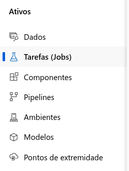
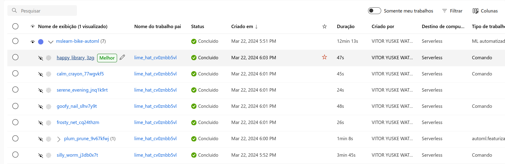
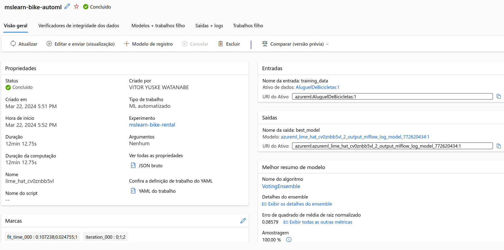
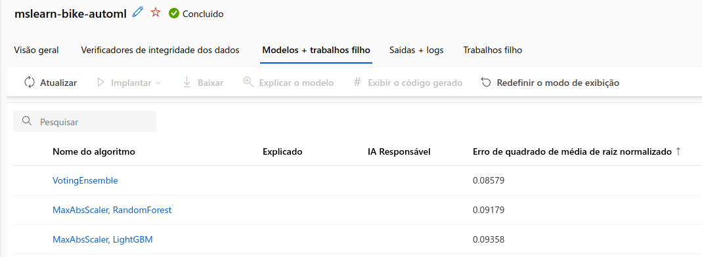
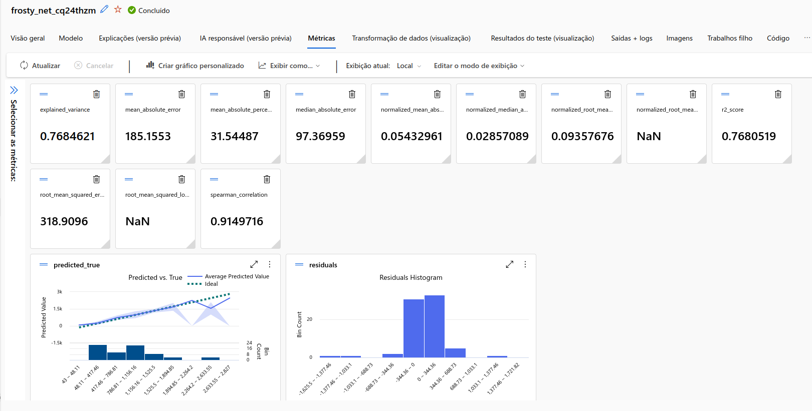

# dio-azure-atividade-0
Trabalhando com Machine Learning na prática no Azure ML.

O foco deste trabalho é treinar um modelo de regressão usando o serviço de computação em núvem do Azure Machine Learning. O conjunto de dados utilizado está presente em [LINK](https://aka.ms/bike-rentals).

## Acessando ambiente

Inicialmente, no menu de criação de recursos, busque pelo serviço Azure Machine Learning.

  

Em seguida, a após criar uma instância, acesse o ambiente de trabalho criado.

  

Após acessar o ambiente, selecione a opção de entrar no Azure Machine Learning Studio.

  

## Criando trabalho

Para criar um trabalho de aprendizado de máquina, foi utilizado o ML automatizado, que se encontra na barra lateral esquerda.

  

Posteriormente, crie um novo trabalho.

  

Defina o nome do trabalho, do experimento e dê uma breve descrição.

  

Defina a tarefa como Regressão e adicione o conjunto de dados

  
  
  
  
  

Configure as opções de realização da tarefa de treinamento, como variàvel a ser predita, tipo de modelo, limites e configuração de validação e teste.

  
  
  

Determine a opção de computação da tarefa, envie o trabalho para ser realizado e aguarde ele ser realizado.

  
  
  

## Verificando encerramento do trabalho

Para verificar o estado do trabalho, acesse a aba "jobs" na barra lateral esquerda.

  

Quando ele estiver encerrado, seu status estará como Concluído em verde.

  

## Avaliando modelos

Para avaliar os modelos, acesse o trabalho, clique na aba Modelos + trabalhos filho e clique na aba Métricas. Além disso, é possível avaliar as métricas do treinamento e comparar os modelos.

  
  
  

## Conclusão

Portanto, foi possível treinar três modelos de regressão para predizer o custo de alguguel de biclicletas e de acordo com a métrica _NormalizedRootMeanSquaredError_ o modelo combinado _VotingEnsemble_ apresentou o menor erro.
