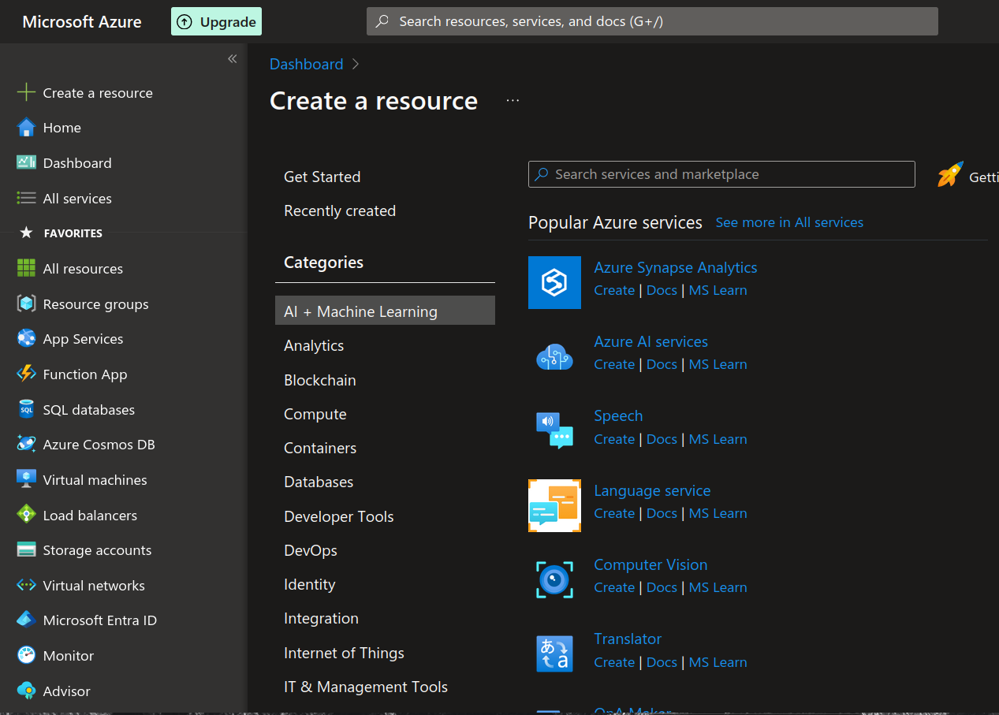
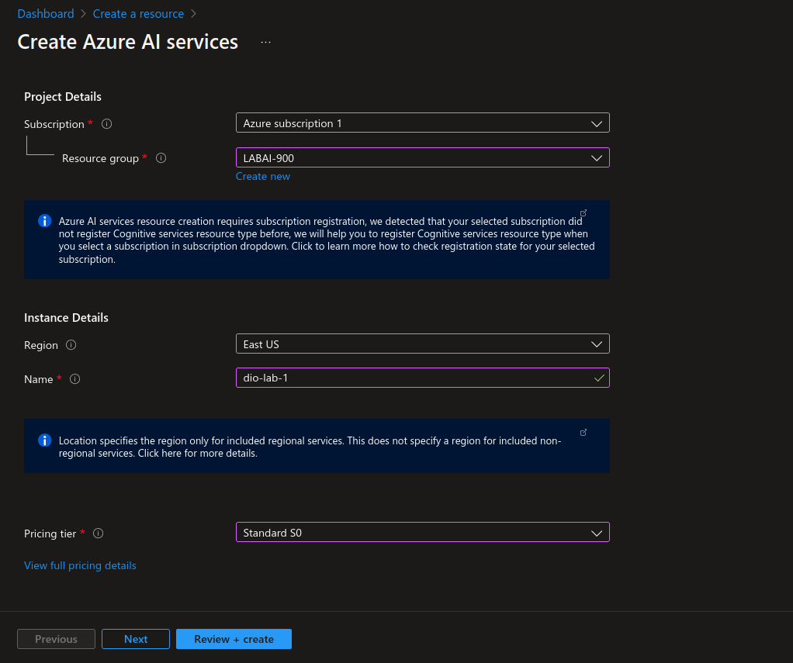
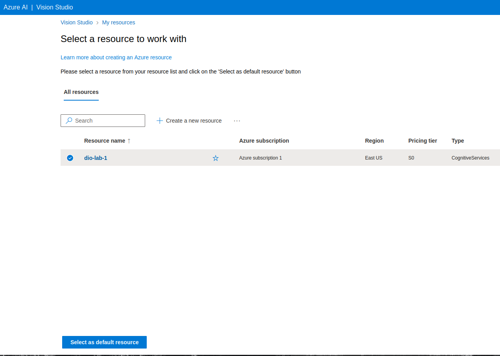
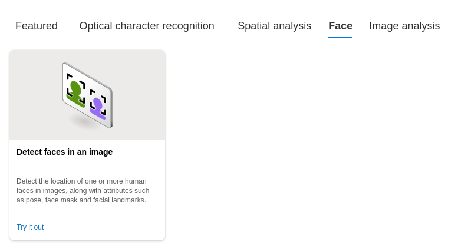
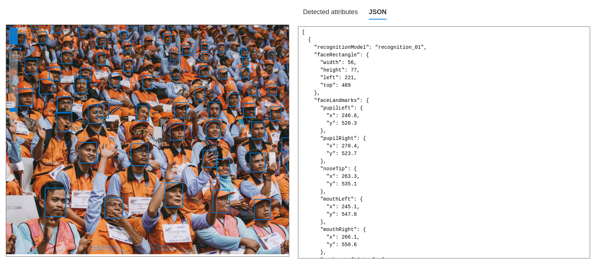
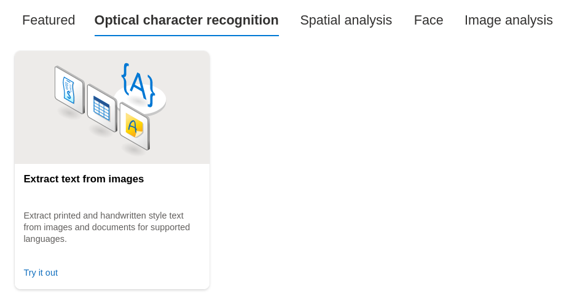
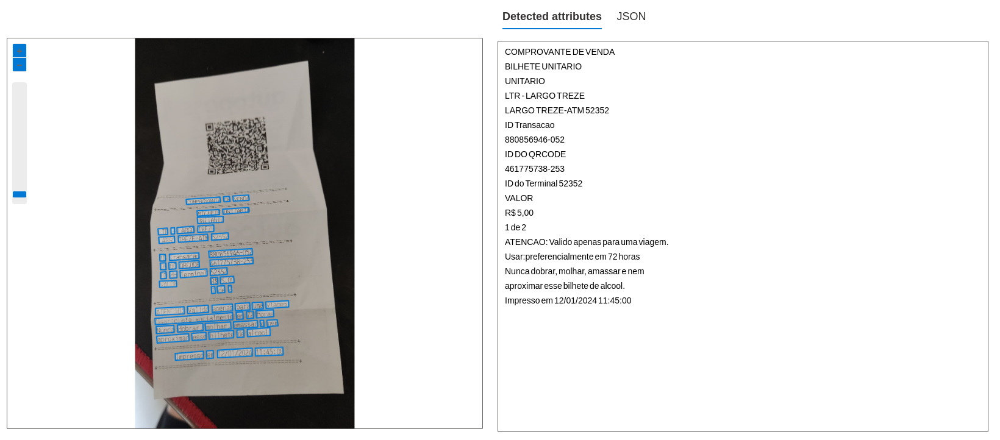

# dio-lab-1
Aplicando algoritmos de Visão Computacional no Azure ML.

O foco deste trabalho é descrever o processo de testar os serviços prontos de visão computacional do Azure em imagens.

## Criando e configurando serviço

Inicialmente, crie o recurso *Azure AI services* na categoria *AI + Machine Learning*.

  
  

Em seguida, acesse o [Vision Studio](https://portal.vision.cognitive.azure.com/gallery/featured) para acessar os serviços de visão computacional e dentro do portal selecione o recurso criado.

  

## Testando o serviço de detecção de faces

Busque pela tarefa de detecção de faces em uma imagem (*Detect faces in an image*).

  

Resultado obtido:

  

## Testando o serviço de extração de texto

Busque pela tarefa de extração de texto em uma imagem (*EXtract text from images*).

  

Resultado obtido:

  

