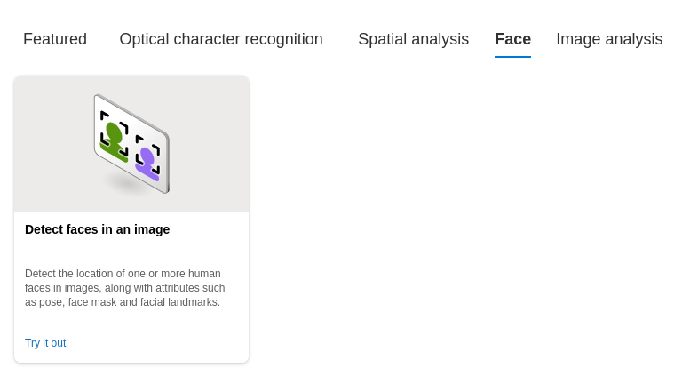

# dio-lab-1

## Criando e configurando serviço

Inicialmente, crie o recurso *Azure AI services* na categoria *AI + Machine Learning*.

  
  

Em seguida, acesse o [Vision Studio](https://portal.vision.cognitive.azure.com/gallery/featured) para acessar os serviços de visão computacional e selecione o recurso criado e busque pela tarefa de detecção de faces em uma imagem.

  
  

Resultado obtido:

  

