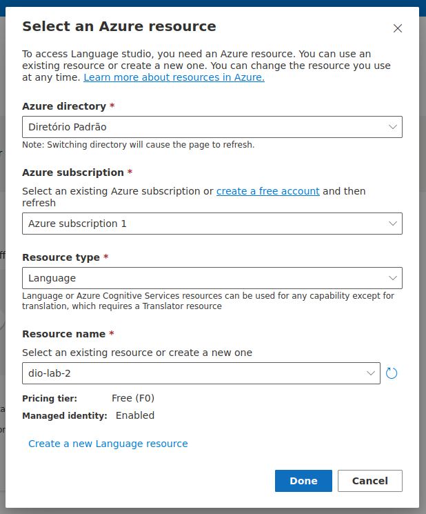

# dio-lab-2
O objetivo deste repositório é documentar o processo de teste dos serviços de conversão de fala em texto e análise de sentimentos do Azure.

## Criando e configurando serviço de fala

Inicialmente, crie o recurso *Azure AI services* na categoria *AI + Machine Learning*.

  
  

Em seguida, foi acessado o [Speech Studio](https://speech.microsoft.com/portal) para acessar os serviços de processamento de fala e dentro do portal foi selecionado o recurso criado.

  

### Testando o serviço de conversão de fala para texto.

Foi selecionado o serviço de conversão de fala para texto, chamado Conversão de fala em texto em tempo real.

  

Resultado obtido usando o [arquivo](./inputs/voicelines.mp3) em inglês:

  

## Criando e configurando serviço de linguagem

Inicialmente, foi criado um serviço de linguagem (*Language service*) na categoria *AI + Machine Learning*. Foram selecionadas as suas caracteristicas, configurações e ao final foi iniciada a sua criação.

  
  
  
  

Em seguida, foi acessado o [Language Studio](https://language.cognitive.azure.com/home) para acessar os serviços de processamento de linguagem e dentro do portal foi selecionado o recurso criado anteriormente.

  

### Testando o serviço de analize de sentimento.

Foi selecionado o serviço de analize de sentimento em texto (*Analyze sentiment and mine opinions*).

  

Resultado obtido usando o [arquivo](./inputs/example.txt) em inglês:

  

## Conclusão

Portanto, foi possível realizar os testes dos serviços e documentar o processo de criação dos recursos, configurações e fornecimentos de exemplos de teste dos serviços.

