# dio-lab-3
O objetivo deste repositório é descrever o passo-a-passo do processo de criação de um serviço de busca em texto automatizada por ia no MIcrosoft Azure. Para mais informações acesse o [LINK](https://microsoftlearning.github.io/mslearn-ai-fundamentals/Instructions/Labs/11-ai-search.html).

## Criando serviço de IA

Inicialmente, foi criado o serviço de IA do Microsoft Azure.

  

## Criando serviço de busca

Em seguida, foi criado o serviço de busca _Azure AI services_.

  

Algumas configurações do serviço:

  
  

## Criando serviço de armazenamento

Para armazenar os dados, foi criado um serviço de armazenamento, chamado _Storage account_. Abaixo estão as configurações usadas para cria-lo.

  
  
  

### Adicionando arquivos de teste

Os arquivos de teste, fornecidos pela Microsoft, podem ser baixados neste [LINK](https://aka.ms/mslearn-coffee-reviews). A seguir, foram demonstrados os passos para adicionar os arquivos no _container_.

  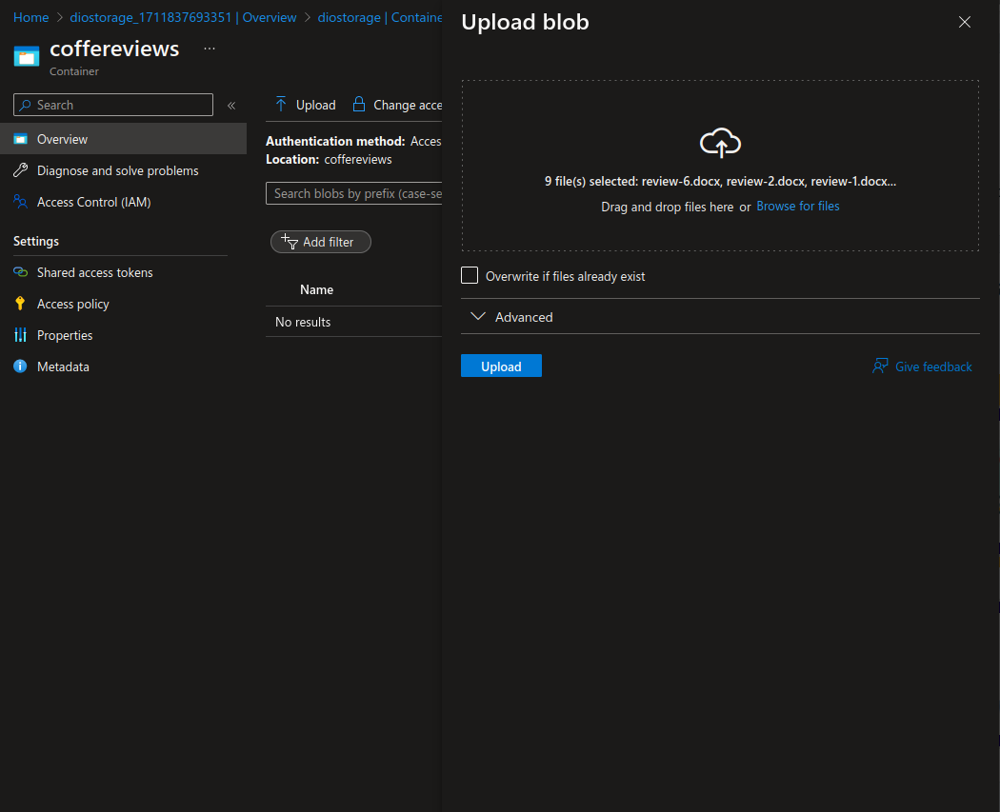
  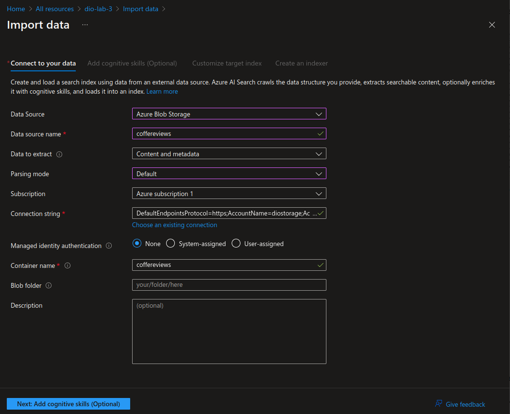
  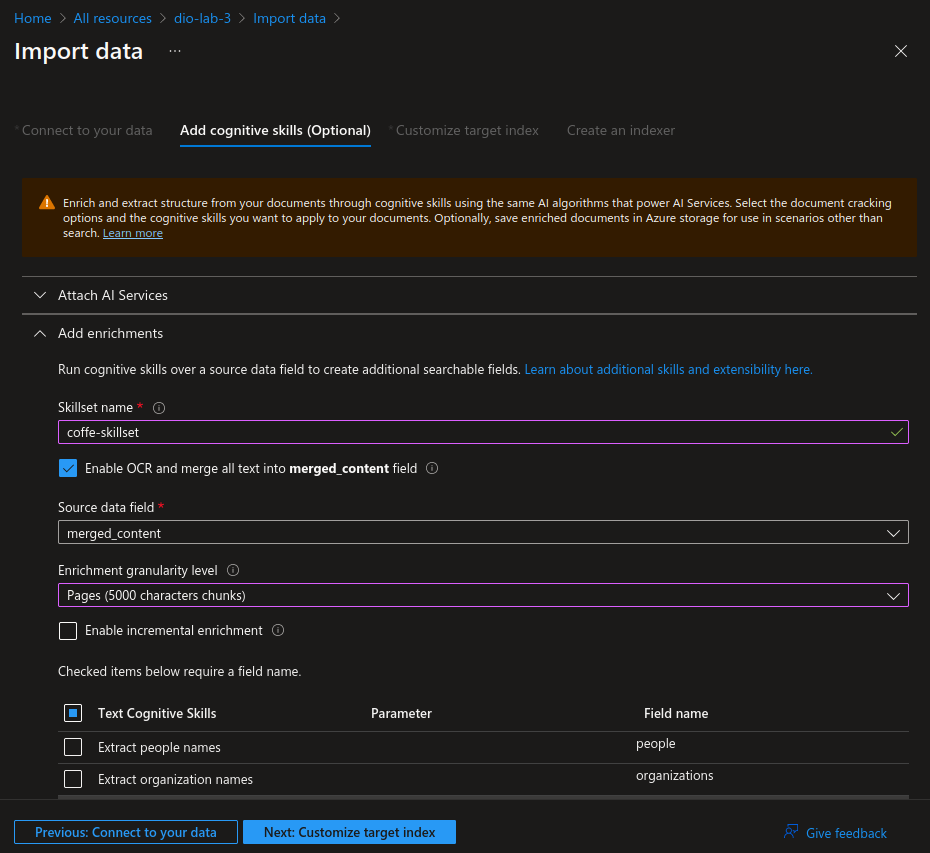
  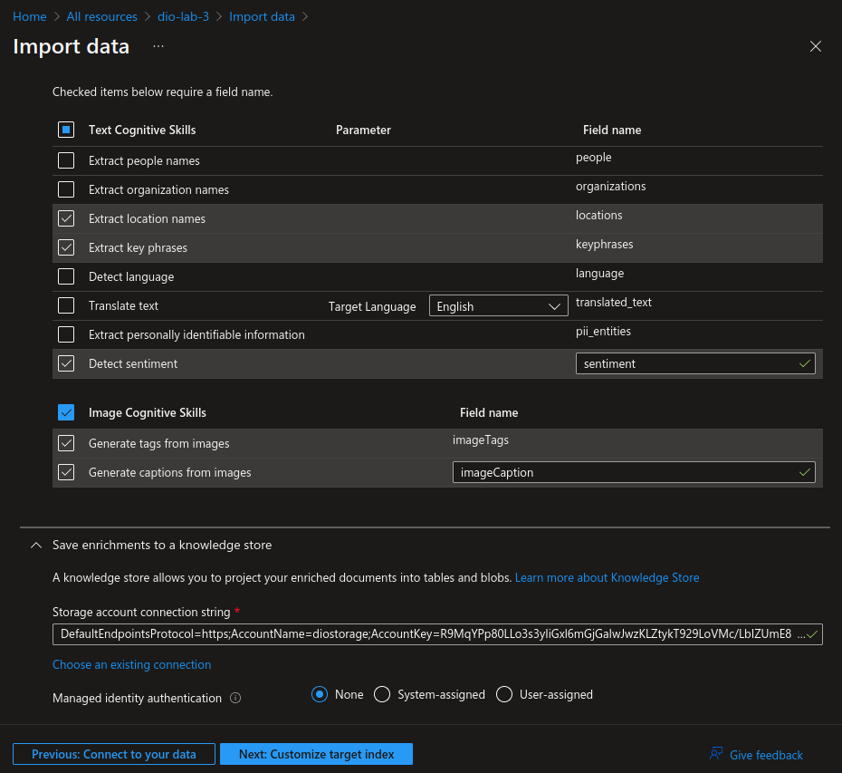
  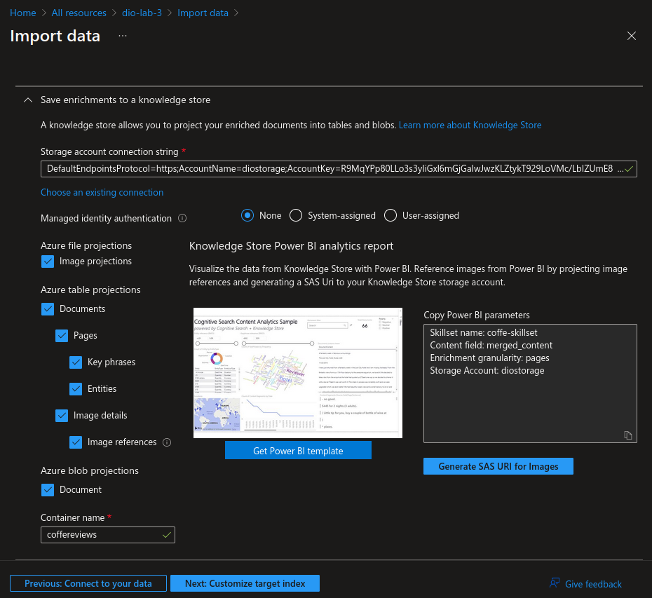
  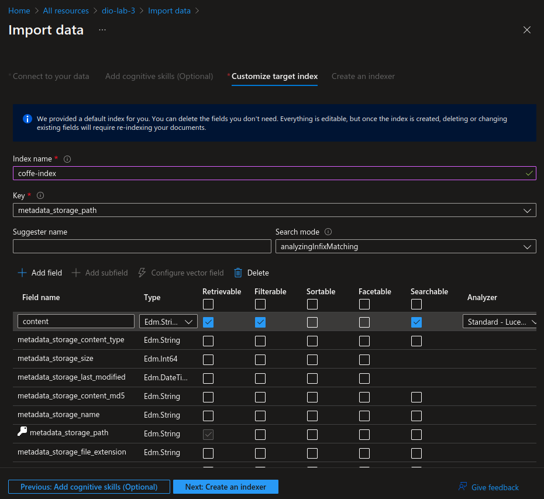
  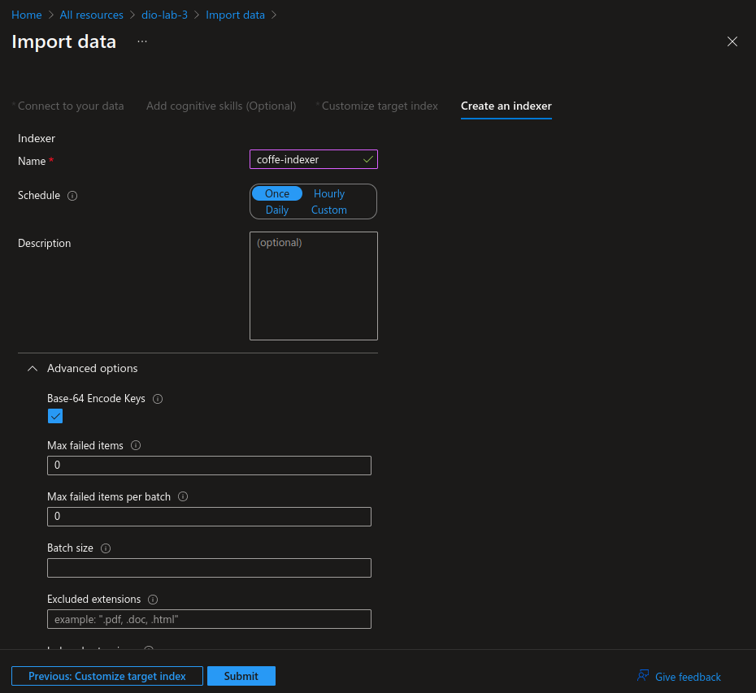

### Verificando arquivos

O passo a seguir foca em apenas verificar se os dados estão prontos para uso. Busque na aba _Indexers_.

  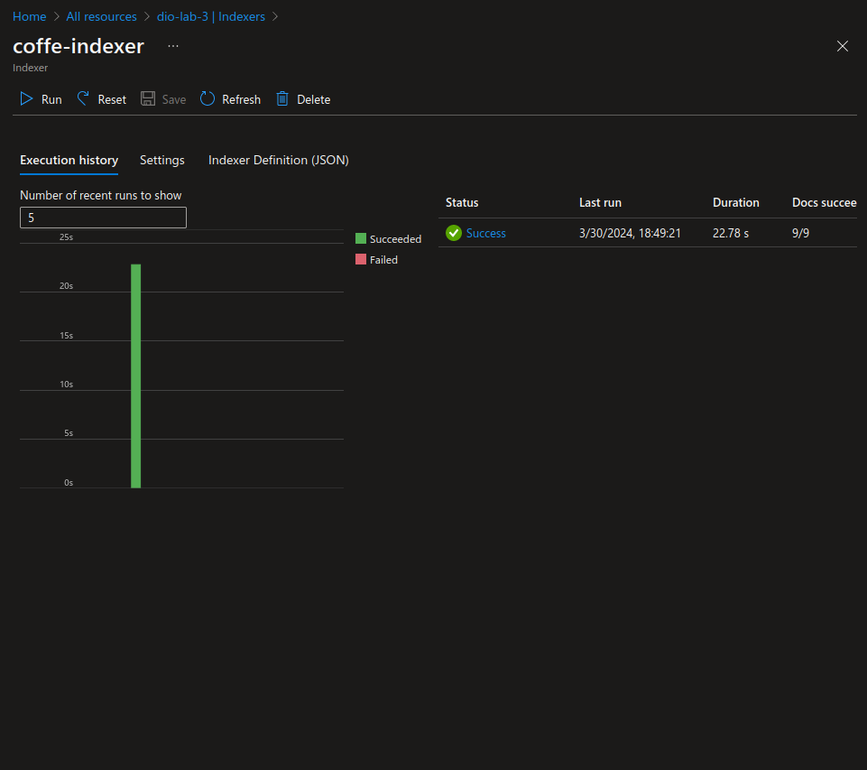

## Resultados

No _Search explorer_, para o index **coffe-index**, será possivel realizar algumas buscas. A primeira imagem apresenta uma busca sem filtro, retornando os dados de todos os arquivos de teste. A segunda imagem apresenta uma busca com a palavra chave **Chicago** no contexto de **localizações**, retornando quantos itens foram encontrados. E por último,
na terceira imagem, uma busca por **sentimentos negativos**, informando a mais quantos casos foram encontrados.

  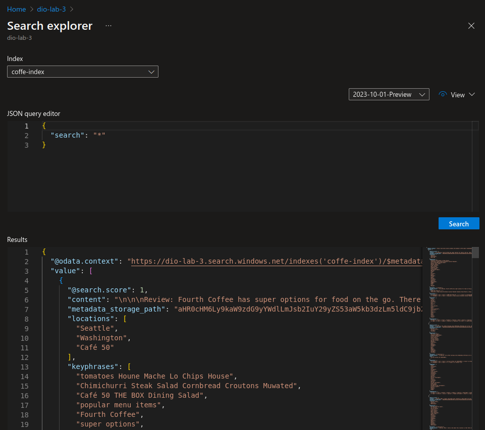
  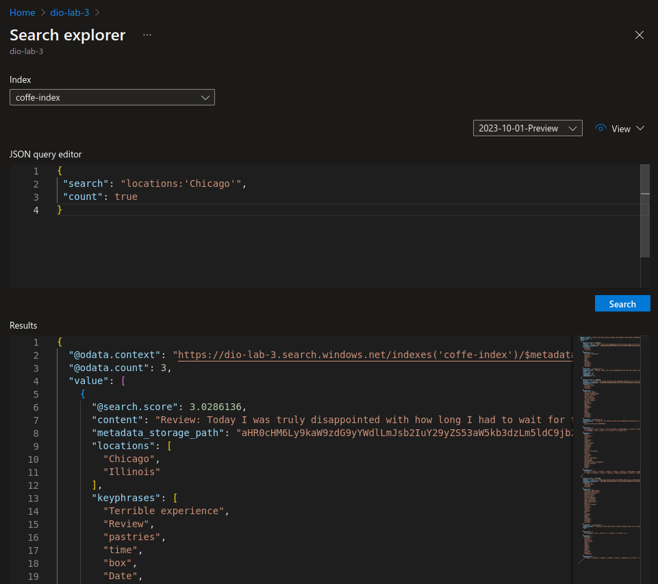
  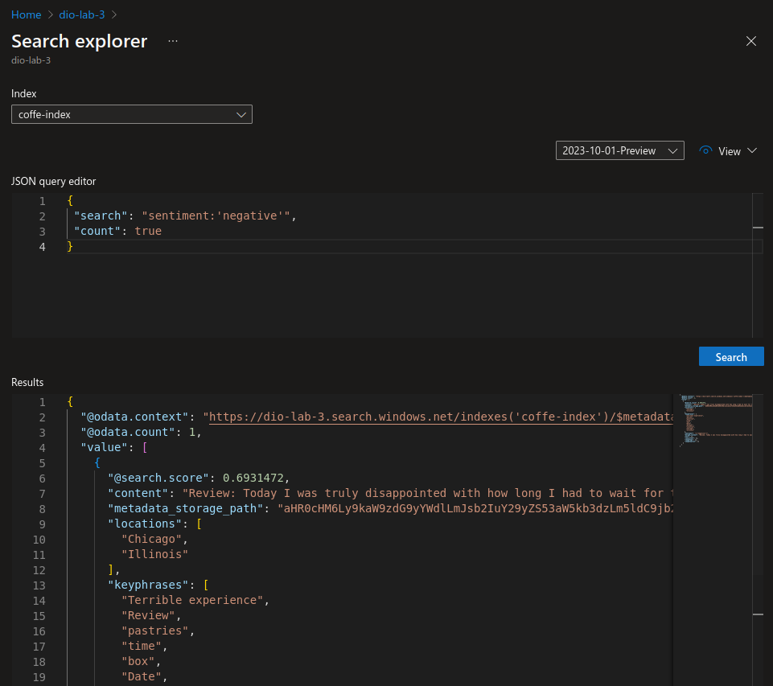

## Conclusão

Portanto, foi possível realizar a atividade de criar o ambiente de busca em arquivos com serviços de IA, que realizava analizes em uma base de textos não estruturada, que foi fornecida pela Microsoft.
