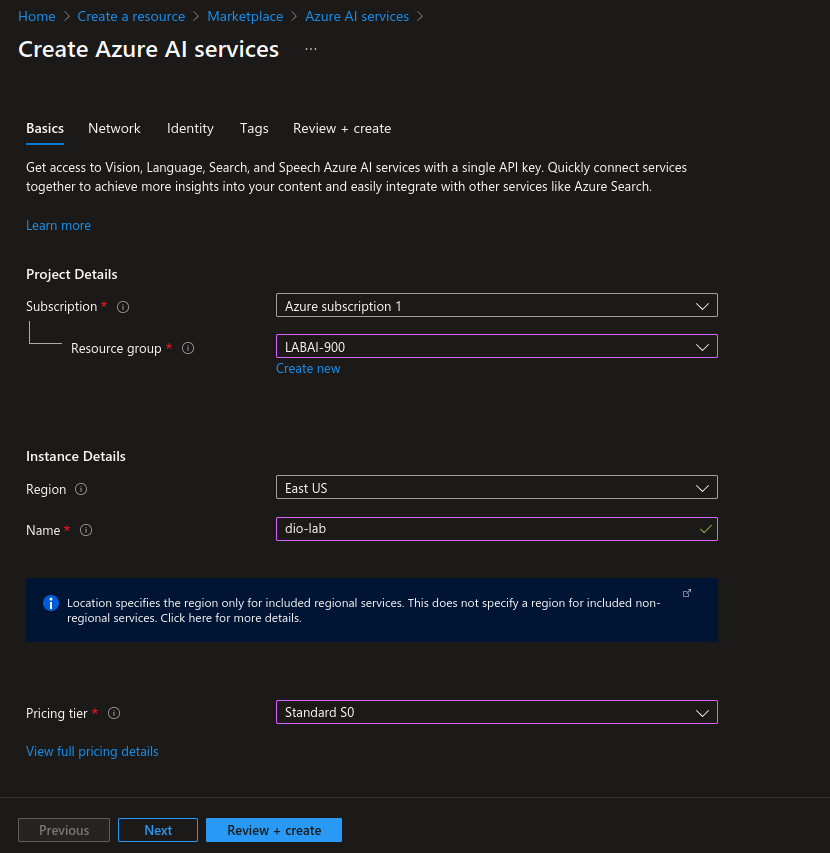
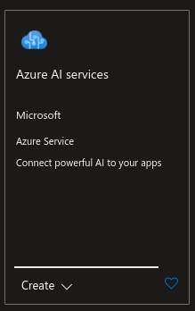
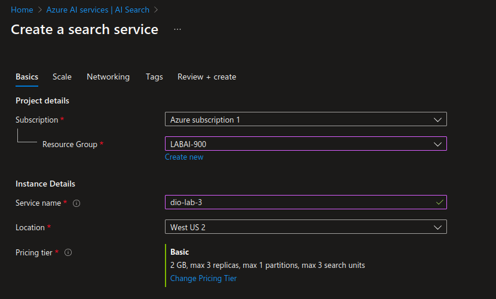
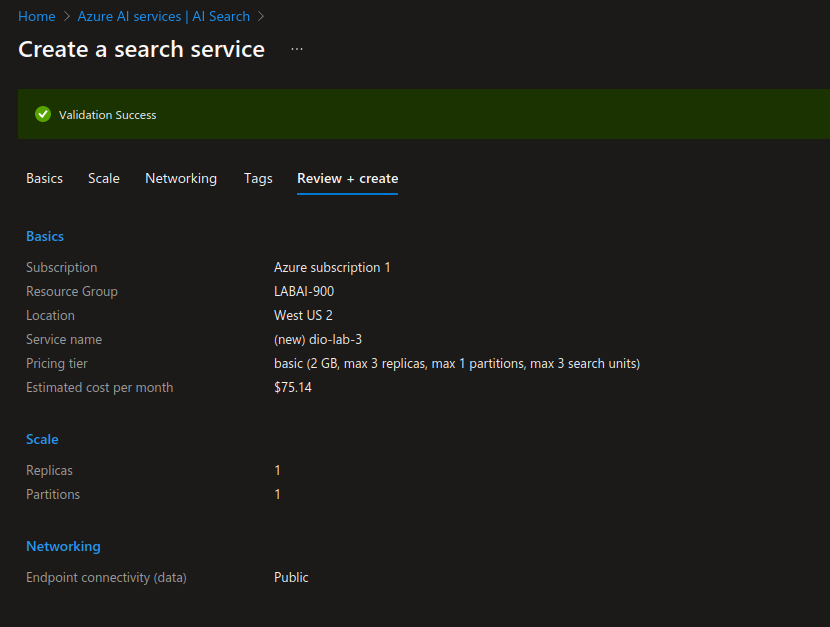
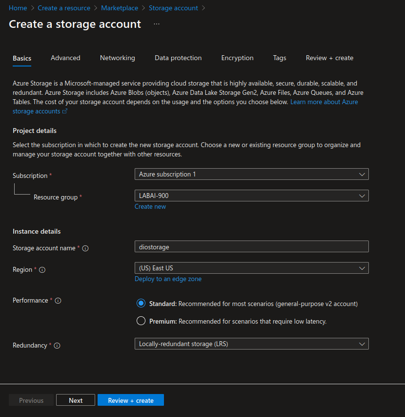
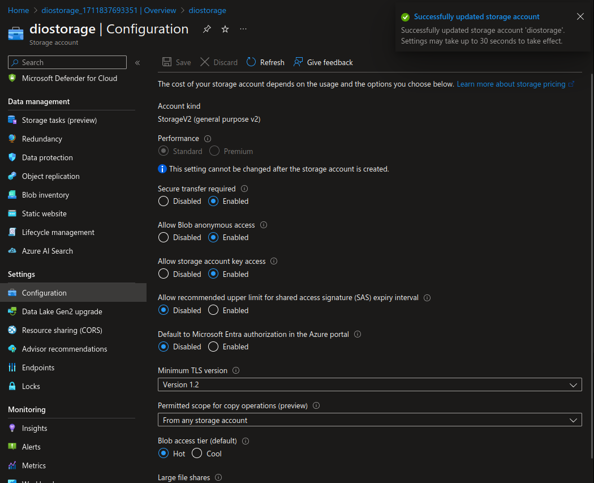
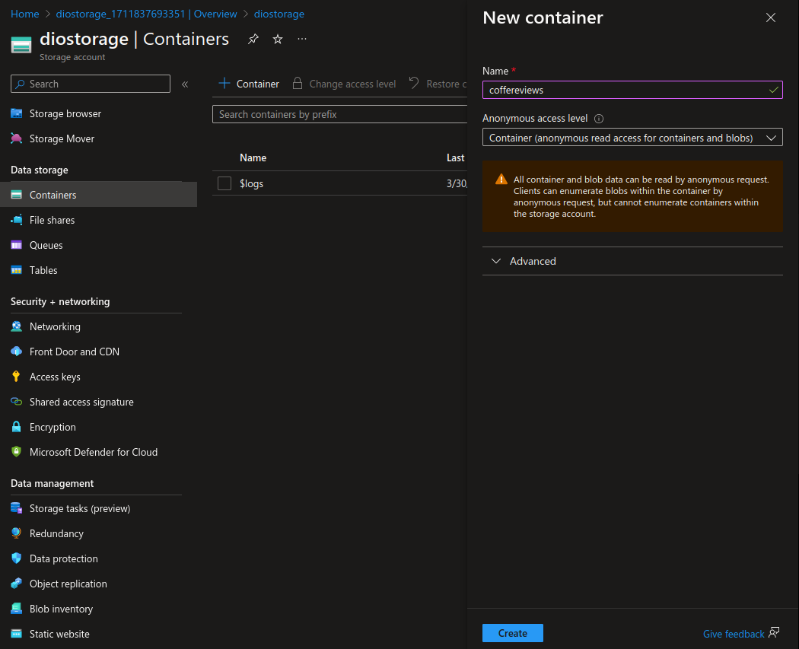

# dio-lab-3
O objetivo deste repositório é descrever o passo-a-passo do processo de criação de um serviço de busca em texto automatizada por ia no MIcrosoft Azure. Para mais informações acesse o [LINK](https://microsoftlearning.github.io/mslearn-ai-fundamentals/Instructions/Labs/11-ai-search.html).

## Criando serviço de IA

Inicialmente, foi criado o serviço de IA do Microsoft Azure.

  

## Criando serviço de busca

Em seguida, foi criado o serviço de busca _Azure AI services_.

  

Algumas configurações do serviço:

  
  

## Criando serviço de armazenamento

Para armazenar os dados, foi criado um serviço de armazenamento, chamado _Storage account_. Abaixo estão as configurações usadas para cria-lo.

  
  
  

### Adicionando arquivos de teste

Os arquivos de teste, fornecidos pela Microsoft, podem ser baixados neste [LINK](https://aka.ms/mslearn-coffee-reviews).

### Verificando arquivos

## Resultados

## Conclusão
